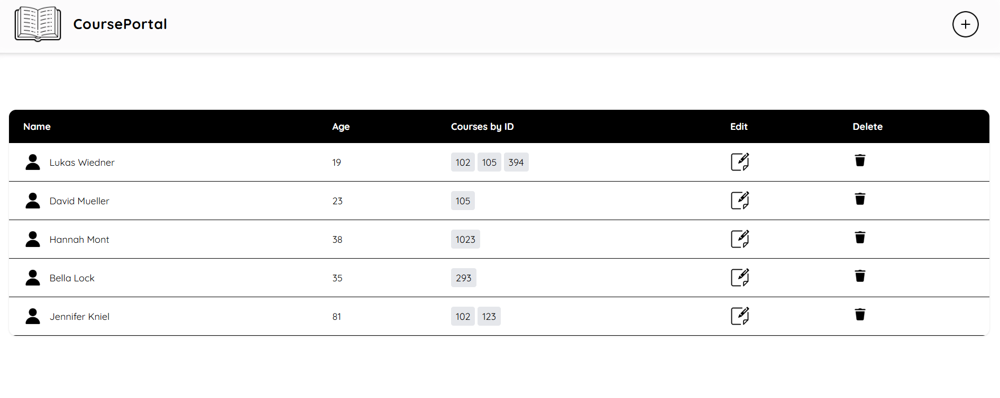
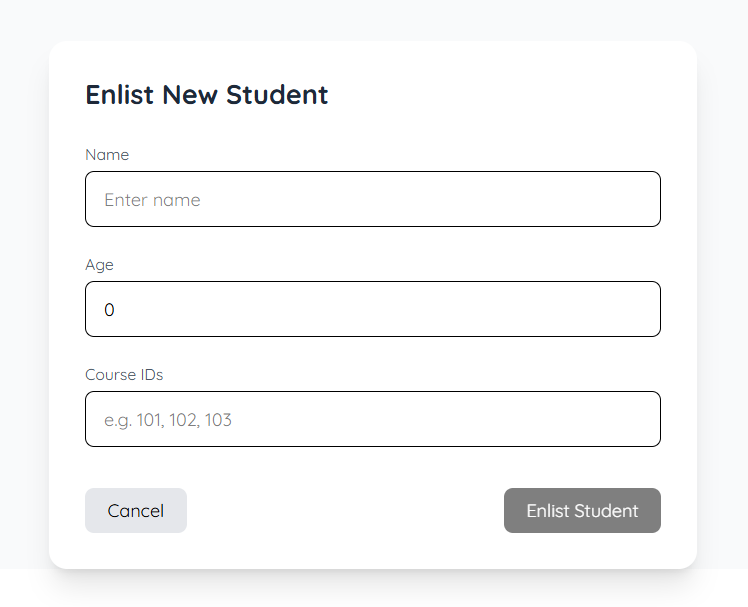
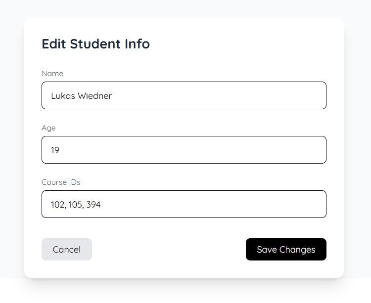

This project focuses on basic HTTP requests by featuring a list of students (name, age, and course id's) which can be added to, deleted from and edited.
The student list is saved in a Mongo DB and accessed through a Springboot Maven backend, with an Angular frontend.

## Screenshots

### Homepage

### Add Student

### Edit Student

