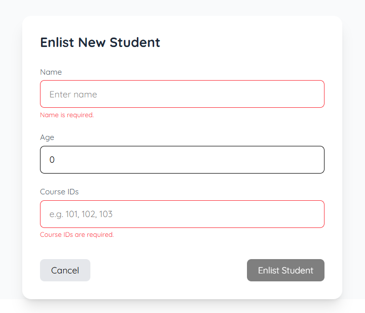
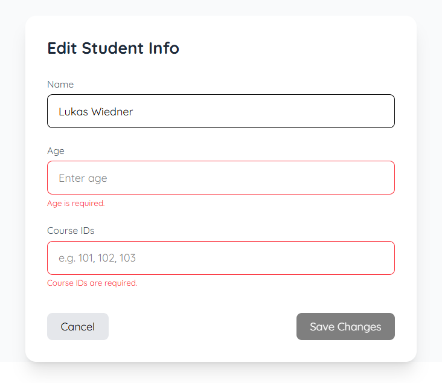

This project focuses on basic HTTP requests: it features a list of students containing names, ages, and course IDs, which can be added to, edited, and deleted from. The data is stored in MongoDB and accessed through a Java Spring Boot backend (Maven), with an Angular frontend (built with TypeScript & HTML).

## Screenshots

### Homepage

### Add Student
New students can be added via a form, which also implements error messages.

  
  

### Edit Student
Students can also be edited via a form, which implements error messages as well.

  
  

